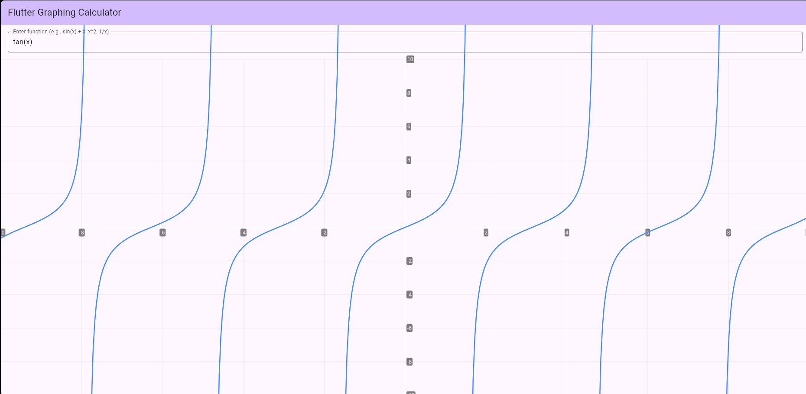

# calc

Minimalist Graphing Calculator that takes a function as input and outputs a graph of the function

# Getting Started

To access the site use https://calcvercel-xwq6.vercel.app

To run locally:

# 1. Clone the repository
git clone https://github.com/breeendon/calc.git
cd calc

# 2. Run the development server
npm run dev

# 3. Use the app!

